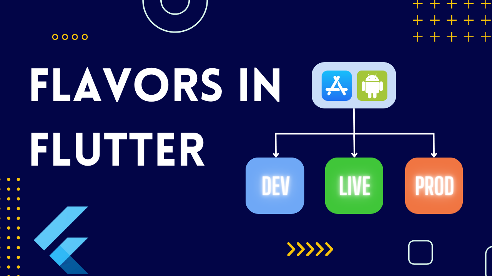

# Flavors Project

## Overview

The **Flavors** project is a Flutter application designed to explore and demonstrate the implementation of Flutter flavors for multi-company and multi-environment setups. This project specifically focuses on testing and experimenting with different configurations for Test, Preprod, and Production environments.

## Table of Contents

-   [Introduction](https://chat.openai.com/c/e45130fa-596b-413c-9182-d4aeacc66ab3#introduction)
-   [Setup](https://chat.openai.com/c/e45130fa-596b-413c-9182-d4aeacc66ab3#setup)
    -   [Prerequisites](https://chat.openai.com/c/e45130fa-596b-413c-9182-d4aeacc66ab3#prerequisites)
    -   [Clone the Repository](https://chat.openai.com/c/e45130fa-596b-413c-9182-d4aeacc66ab3#clone-the-repository)
    -   [Install Dependencies](https://chat.openai.com/c/e45130fa-596b-413c-9182-d4aeacc66ab3#install-dependencies)
-   [Configuration](https://chat.openai.com/c/e45130fa-596b-413c-9182-d4aeacc66ab3#configuration)
    -   [Flavors Configuration](https://chat.openai.com/c/e45130fa-596b-413c-9182-d4aeacc66ab3#flavors-configuration)
    -   [Environment Configuration](https://chat.openai.com/c/e45130fa-596b-413c-9182-d4aeacc66ab3#environment-configuration)
-   [Usage](https://chat.openai.com/c/e45130fa-596b-413c-9182-d4aeacc66ab3#usage)
-   [Testing](https://chat.openai.com/c/e45130fa-596b-413c-9182-d4aeacc66ab3#testing)
-   [Contributing](https://chat.openai.com/c/e45130fa-596b-413c-9182-d4aeacc66ab3#contributing)
-   [License](https://chat.openai.com/c/e45130fa-596b-413c-9182-d4aeacc66ab3#license)

## Introduction

Flavors in Flutter allow you to build and deploy different instances of your application, each configured for a specific environment or company. This project aims to provide a template and examples for setting up flavors in a Flutter project and handling multiple environments such as testing, preproduction, and production.

## Setup

### Prerequisites

Ensure that you have Flutter and Dart installed on your development machine. If not, please follow the official Flutter installation guide.

### Clone the Repository

Clone the **Flavors** repository to your local machine:

bashCopy code

`git clone https://github.com/your-username/flavors.git` 

### Install Dependencies

Navigate to the project directory and install the required dependencies:

bashCopy code

`cd flavors
flutter pub get` 

## Configuration

### Flavors Configuration

Flavors are defined in the `lib/config/flavors.dart` file. You can customize and add flavors to suit your multi-company setup.

    class FlavorConfig {
      static Flavor flavor = Flavor.PROD; // Change this to the desired flavor
    }
    
    enum Flavor {
      TEST,
      PREPROD,
      PROD,
    }

### Environment Configuration

Environment-specific configurations can be found in the `lib/config/environment.dart` file. Customize this file based on the requirements of your testing, preproduction, and production environments.

    class EnvironmentConfig {
      static String apiUrl = _getApiUrl();
    
      static String _getApiUrl() {
        switch (FlavorConfig.flavor) {
          case Flavor.TEST:
            return "https://api.test.com";
          case Flavor.PREPROD:
            return "https://api.preprod.com";
          case Flavor.PROD:
            return "https://api.prod.com";
          default:
            return "https://api.prod.com";
        }
      }
    } 

## Usage

Run the app using the desired flavor:

bashCopy code

`flutter run --flavor=prod` 

Replace `prod` with `test` or `preprod` as needed.

## Testing

Ensure that you thoroughly test each flavor in its respective environment to validate the configurations and behavior.

## Contributing

Contributions are welcome! Feel free to open issues, create pull requests, or suggest improvements.

## License

This project is licensed under the MIT License.
